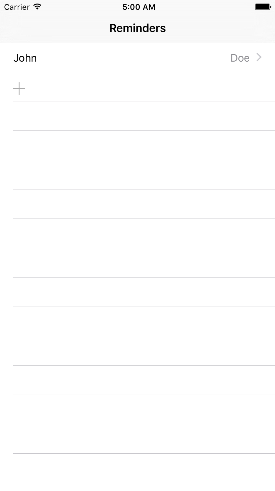
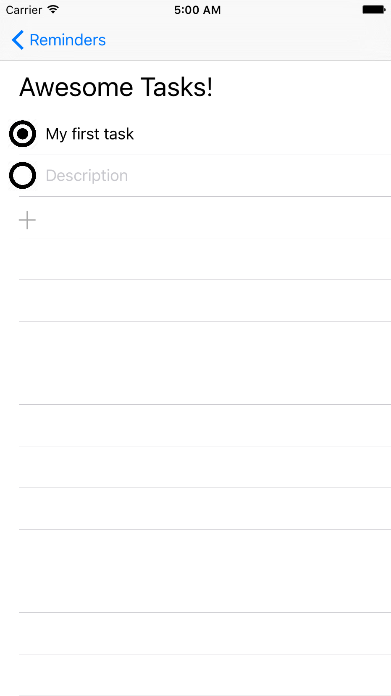
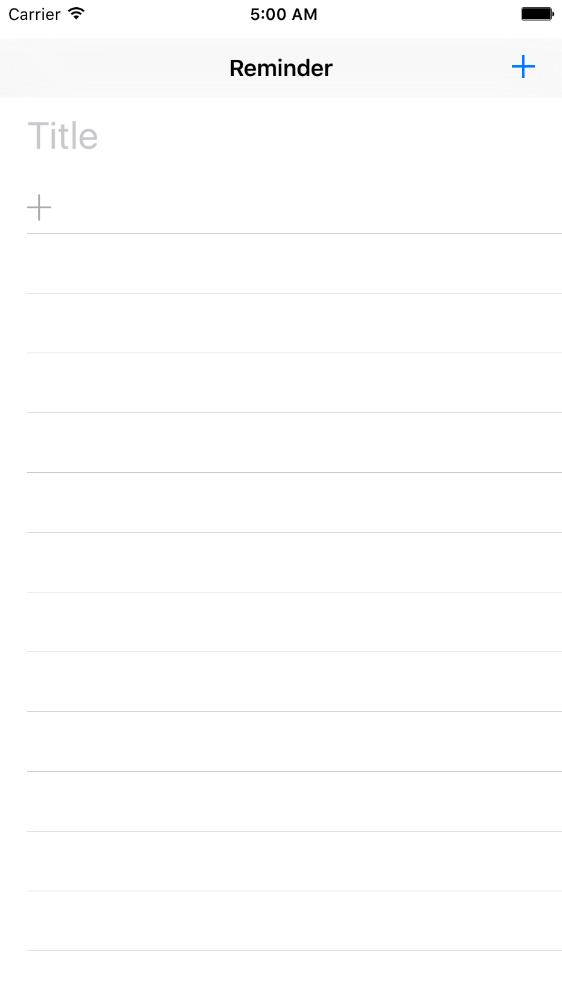

# Reminders

Assignment 5
https://github.com/tommysusanto/assg5.git

All requirements implemented. Bonus Delete function also implemented.

This project demonstrates:
- Table Views
- Multiple Table View Cell Prototypes
- Delegates & DataSources
- Protocol
- Embedding ViewControllers in Containers 

| Screenshots                                                                     |
| ---                                                                             |
|  |
|  |
|  |
